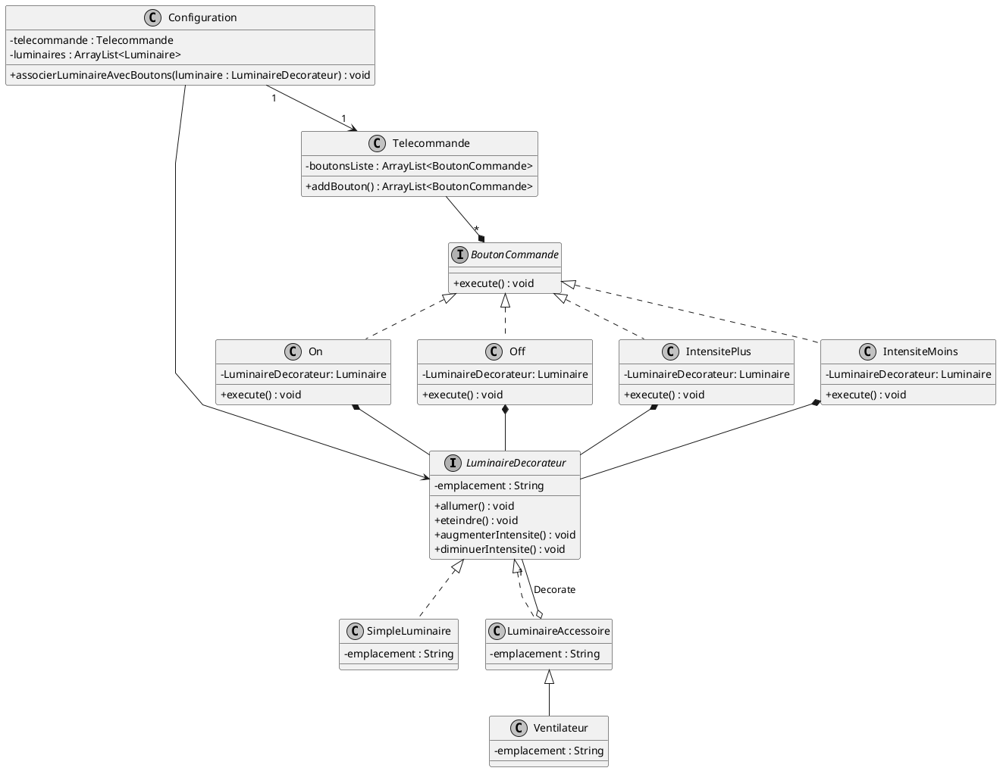

# Pseudo-Code

ArrayList<LuminaireDecorateur> luminairesDecorateurs = new ArrayList<LuminaireDecorateur>();
luminaireDecocateurs.add(Luminaire )

for (LuminaireDecorateur luminaire : luminairesDecorateurs) {
    if(luminaire instanceof simpleLuminaire){
        Commande allumerLumiere = new On(luminaire);
        Commande eteindreLumiere = new OFF(luminaire);
        Commande augmenterIntensiteLuminaire = new IntensitePlus(luminaire);
        Commande diminuerIntensiteLuminaire = new IntensiteMoins(luminaire);
        telecommande.addBouton(allumerLumiere);
        telecommande.addBouton(eteindreLumiere);
        telecommande.addBouton(augmenterIntensiteLuminaire);
        telecommande.addBouton(diminuerIntensiteLuminaire);
    }
    if (luminaire instance LuminaireAccessoire) {
        Commande allumerAccessoire = new On(luminaire);
        Commande eteindreAccessoire = new OFF(luminaire);
        Commande augmenterIntensiteAccessoire = new IntensitePlus(luminaire);
        Commande diminuerIntensiteAccessoire = new IntensiteMoins(luminaire);
        telecommande.addBouton(allumerAccessoire);
        telecommande.addBouton(eteindreAccessoire);
        telecommande.addBouton(augmenterIntensiteAccessoire);
        telecommande.addBouton(diminuerIntensiteAccessoire);
    }
    
}

